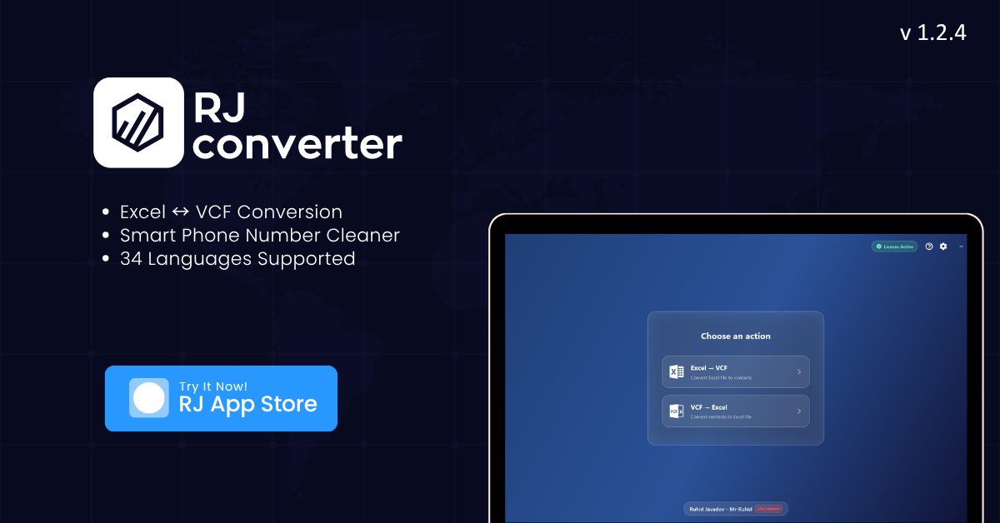

<div align="center">



<br><br>


**Convert between Excel (.xlsx) and VCF (contacts) in seconds.**

A modern, multilingual Flutter desktop application for Windows.

[](https://flutter.dev)
[](https://dart.dev)
[](https://www.microsoft.com/windows)
[](https://github.com/mr-ruhid/rjnumber_fileconverter/releases)
[](#supported-languages)

[Download](https://github.com/mr-ruhid/rjnumber_fileconverter/releases) &nbsp;|&nbsp;
[ Demo Video](https://youtu.be/MPrmKaRF5js) &nbsp;|&nbsp;
[Building from Source](#building-from-source) &nbsp;|&nbsp;
[Report a Bug](https://github.com/mr-ruhid/rjnumber_fileconverter/issues)

</div>

---

## Table of Contents

- [About](#about)
- [Demo](#demo)
- [Features](#features)
- [Supported Languages](#supported-languages)
- [Tech Stack](#tech-stack)
- [Project Structure](#project-structure)
- [Installation](#installation)
- [Building from Source](#building-from-source)
- [Changelog](#changelog)
- [Contributing](#contributing)
- [License](#license)
- [Author](#author)
- [Support the Project](#support-the-project)

---

## About

[**Converter**](https://github.com/mr-ruhid/rjnumber_fileconverter) is a Windows desktop application for converting between **Excel (.xlsx)** and **vCard (.vcf)** formats. Whether you need to import a client list into your phone or export contacts to a spreadsheet, Converter handles the job in a few clicks.

The interface follows a modern glassmorphism design language, includes Lottie animations, and ships with **34 languages** and a built-in language switcher.

---

## Demo

 Watch a short walkthrough of how the application works:

[](https://youtu.be/MPrmKaRF5js)

> Video: [https://youtu.be/MPrmKaRF5js](https://youtu.be/MPrmKaRF5js)

---

## Features

| Feature | Description |
|:---|:---|
| **Bidirectional conversion** | Convert Excel to VCF and VCF to Excel. Reads `.xlsx` files, cleans and standardizes phone numbers, and writes valid VCF files. |
| **34 languages** | Full UI localization with native language names (Azərbaycan, English, Türkçe, Русский, العربية, فارسی, 中文, 日本語, हिन्दी, and more). |
| **Smart header detection** | Automatically finds the Name and Phone columns regardless of position, language, or exact wording (`name`, `user`, `customer`, `ad`, `adı soyadı`, `tel`, `mobile`, `telefon`, etc.). |
| **International phone support** | Recognizes 39 country codes (Azerbaijan, Turkey, Russia, USA, UK, Germany, India, China, and more) and standardizes number formatting. |
| **Licensing and trial** | Built-in license verification with a one-time free trial before a license code is required. |
| **Frameless fullscreen** | Custom window controls with the native Windows title bar removed. Launches maximized in frameless mode. |
| **Modern UI/UX** | Blur and glassmorphism effects, gradient backgrounds, Lottie animations, SVG icons, and interactive loading screens. |
| **Robust Excel sanitizer** | Cleans non-standard metadata (Chinese-locale date formats, dynamic array metadata, Excel Online output) that breaks standard XLSX parsers. |

---

## Supported Languages

| Code | Language | Code | Language |
|:---:|:---|:---:|:---|
| `az` | Azərbaycan dili | `en` | English |
| `tr` | Türkçe | `ru` | Русский |
| `ar` | العربية | `fa` | فارسی |
| `he` | עברית | `ur` | اردو |
| `de` | Deutsch | `fr` | Français |
| `es` | Español | `it` | Italiano |
| `pt` | Português | `nl` | Nederlands |
| `ro` | Română | `hy` | Հայերեն |
| `ka` | ქართული | `hi` | हिन्दी |
| `bn` | বাংলা | `pa` | ਪੰਜਾਬੀ |
| `ta` | தமிழ் | `te` | తెలుగు |
| `mr` | मराठी | `zh` | 中文 |
| `ja` | 日本語 | `ko` | 한국어 |
| `th` | ไทย | `vi` | Tiếng Việt |
| `id` | Bahasa Indonesia | `ms` | Bahasa Melayu |
| `jv` | Basa Jawa | `tl` | Tagalog |
| `sw` | Kiswahili | `ha` | Hausa |

---

## Tech Stack

| Category | Technology |
|:---|:---|
| Framework | Flutter (Dart) |
| State management | `provider` |
| Desktop window management | `window_manager` |
| File operations | `excel`, `file_picker` |
| Archive processing | `archive` (XLSX sanitization) |
| Storage / caching | `shared_preferences` |
| Animations and UI | `lottie`, `flutter_svg` |
| External links | `url_launcher` |
| Localization | `flutter_localizations`, `intl` |

---

## Project Structure

```text
rjnumber_fileconverter/
├── assets/
│   ├── banner/
│   │   └── banner.png
│   ├── logo/
│   │   ├── logo.svg
│   │   └── applogo.png
│   ├── icon/
│   │   ├── excel.svg
│   │   ├── vcf.svg
│   │   ├── github.svg
│   │   ├── gitlab.svg
│   │   ├── youtube.svg
│   │   ├── youtube-red.svg
│   │   ├── discord.svg
│   │   ├── blogger.svg
│   │   └── web.svg
│   ├── animation/
│   │   ├── loading.json
│   │   ├── convert.json
│   │   ├── phone.json
│   │   ├── file.json
│   │   ├── nolicence.json
│   │   └── yeslicence.json
│   └── licence/
│       └── licence.json
├── lib/
│   ├── l10n/
│   │   ├── app_*.arb                  # 34 .arb files
│   │   ├── app_localizations.dart
│   │   ├── app_localizations_*.dart
│   │   └── supported_languages.dart
│   ├── models/
│   │   └── contact.dart
│   ├── screens/
│   │   ├── about_dialog.dart
│   │   ├── excel_to_vcf_page.dart
│   │   ├── home_page.dart
│   │   ├── licensing_controller.dart
│   │   ├── settings_page.dart
│   │   └── vcf_to_excel_page.dart
│   ├── services/
│   │   ├── converter_service.dart
│   │   ├── settings_service.dart
│   │   └── shared/
│   │       ├── file_utils.dart
│   │       └── phone_utils.dart
│   ├── ui/
│   │   ├── app_theme.dart
│   │   ├── language_provider.dart
│   │   ├── theme_provider.dart
│   │   └── widgets/
│   │       ├── app_header.dart
│   │       ├── glass_card.dart
│   │       ├── license_badge.dart
│   │       ├── loading_overlay.dart
│   │       └── window_controls.dart
│   └── main.dart
├── windows/                           # Windows runner and native build files
├── pubspec.yaml
├── l10n.yaml
└── README.md
```

---

## Installation

The easiest way to get started is to use the prebuilt installer.

1. Open the [Releases page](https://github.com/mr-ruhid/rjnumber_fileconverter/releases).
2. Download the latest `.exe` installer.
3. Run the installer and follow the setup wizard.

---

## Building from Source

**Prerequisites:** [Flutter SDK](https://docs.flutter.dev/get-started/install) with Windows desktop support enabled.

**1. Install dependencies**

```bash
flutter pub get
```

**2. Generate localizations**

```bash
flutter gen-l10n
```

**3. Run in debug mode**

```bash
flutter run -d windows
```

**4. Build a release version**

```bash
flutter build windows --release
```

The compiled application will be available at:

```text
build\windows\x64\runner\Release\
```

---

## Changelog

### Latest version

- Bidirectional conversion: Excel to VCF and VCF to Excel
- 34 languages with a native-name language switcher
- Smart header detection for Name and Phone columns in any Excel layout
- International phone support with 39 recognized country codes
- Excel metadata sanitizer for non-standard XLSX files (Excel Online, Chinese locale, dynamic arrays)
- Frameless fullscreen mode with custom window controls
- Custom SVG icons for action buttons and social links
- Lottie animations on the conversion pages
- Social links in the About dialog (GitHub, GitLab, YouTube, Discord, Blog, Website)

---

## Contributing

Contributions are welcome. To improve the conversion logic, refine the UI, add a new language, or fix a bug:

1. Fork the repository.
2. Create a feature branch: `git checkout -b feature/your-feature`.
3. Commit your changes: `git commit -m "Add your feature"`.
4. Push the branch: `git push origin feature/your-feature`.
5. Open a pull request.

You can also [open an issue](https://github.com/mr-ruhid/rjnumber_fileconverter/issues) to report a bug or suggest an improvement.

---

## License

Copyright &copy; 2026 Converter. All rights reserved.

---

## Author

**Ruhid Javadov** (Mr-Ruhid)

| Platform | Link |
|:---|:---|
| GitHub | [mr-ruhid](https://github.com/mr-ruhid) |
| GitLab | [ruhidjavadoff](https://gitlab.com/ruhidjavadoff) |
|  YouTube | [@ruhidjavadoff](https://www.youtube.com/@ruhidjavadoff) |
| Blog | [ruhidjavadoff.blogspot.com](https://ruhidjavadoff.blogspot.com) |
| Discord | [Join the server](https://discord.com) |
| Website | [ruhidjavadov.site](https://ruhidjavadov.site) / [ruhidjavadoff.site](https://ruhidjavadoff.site) |

---

## Support the Project

If Converter saves you time, consider supporting its development. Every contribution helps keep the project alive.

[](https://kofe.al/@ruhidjavadoff)
[](https://cayvoy.com/donate/ruhid4715)
[](https://www.paypal.com/paypalme/ruhidjavadoff)

| Method | Details |
|:---|:---|
| PayPal | `ruhidjavadoff@gmail.com` |
| Crypto (USDT, BNB Smart Chain) | `0x9a4AD41762D6B07B8C266b312Cf0dBe31FAd890c` |